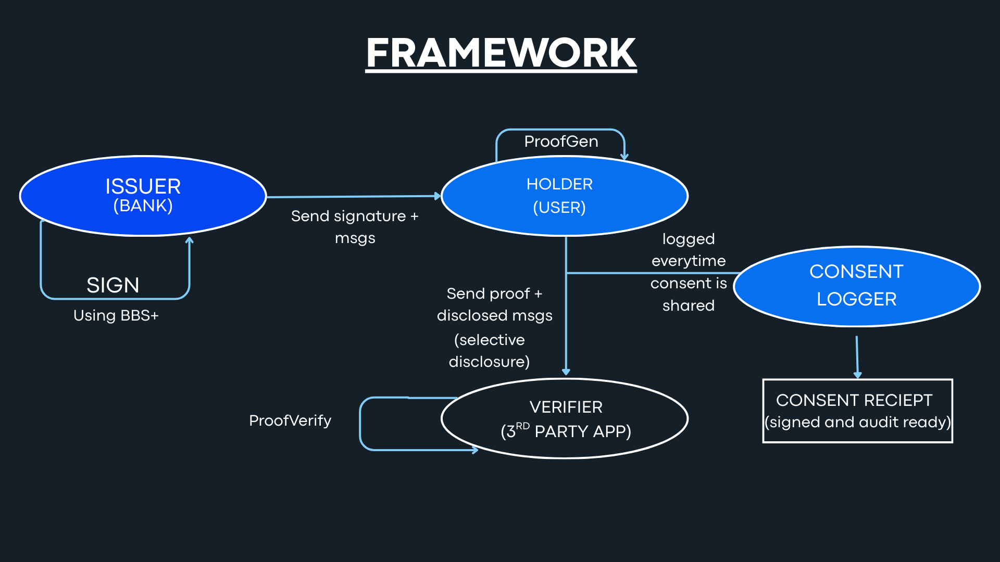
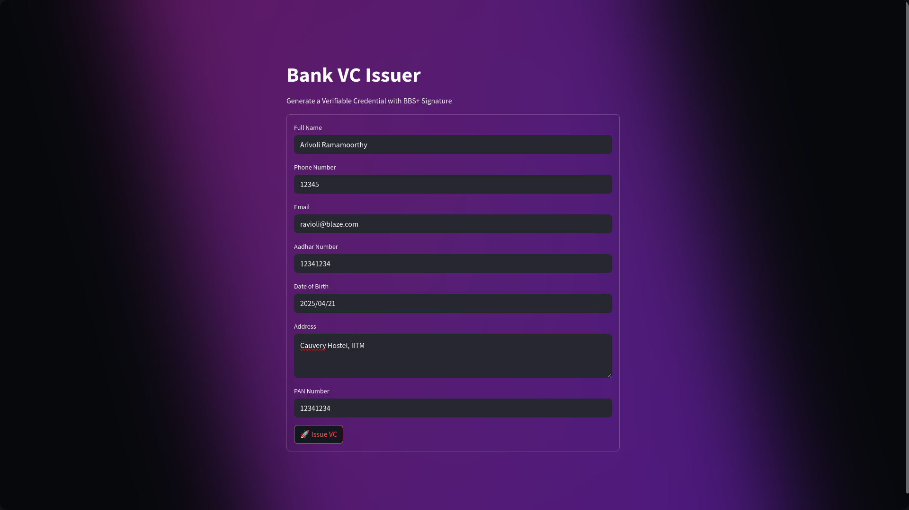
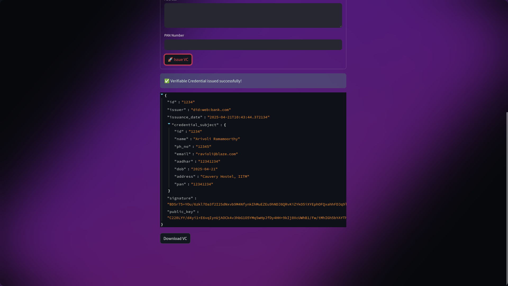
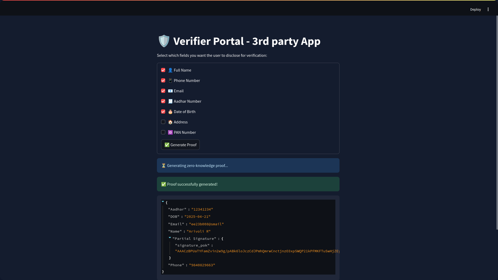

# The Next UPI Moment is Here — For Identity

In 2016, UPI revolutionized how India moved money.  
Now, it’s time to revolutionize how India moves *identity*.

> What UPI did for payments, **Self-Sovereign Identity (SSI)** will do for digital trust:  
> Instant, verifiable, and under user control.

In today’s world, your Aadhaar, PAN, and income data are handed over to dozens of apps without audit, limits, or proof of consent.  
But imagine a future where **you can prove who you are, without revealing everything you are**.

This project is our vision for that future:  
A privacy-first, DPDP-compliant identity layer for India, built using:

- **BBS+ cryptographic signatures**
- **Verifiable Credentials (W3C VC)**
- **User-owned consent trails**

We call it:

- **SSI Wallet** — A decentralized identity wallet with selective disclosure.
- **ConsentCast** — A verifiable, tamper-proof consent logger.

Together, they flip the model:  
From **data extraction** ➜ to **data empowerment**.

---

## ✨ Vision: Redefining Identity for Bharat

India took a leap in financial inclusion with **UPI**.  
We believe the next leap is in **identity autonomy**.

With SSI Wallet + ConsentCast:

- You don’t submit full KYC everywhere — you **prove only what’s required**
- Every share is **logged, signed, and auditable**
- Verifiers get cryptographic proof — not PDFs or screenshots

This isn't just a better system.  
It's a **new social contract** for identity in the digital age.

---

## 🔍 The Problem with Digital Identity Today

- You upload your Aadhaar. Again. And again.
- Apps store full KYC documents they don’t need.
- No way to audit *what* you shared, *when*, and *with whom*.
- Companies collect, but don’t always protect, your identity.

---

## 💡 Our Solution: Consent-Driven, Cryptographically Verified Identity

> Powered by open standards (W3C VC), advanced cryptography (BBS+), and Indian regulation (DPDP).

✅ Users store credentials issued by banks/authorities  
✅ They generate zero-knowledge proofs to share just needed data  
✅ Every data-sharing event is signed and logged  
✅ Regulators can audit trails, and users stay in control

---

## System Diagram



**Flow**:
1. Bank signs credential using BBS+
2. User (holder) stores it in a wallet
3. When asked, user shares *only required fields* with a zero-knowledge proof
4. Verifier checks the proof and logs the interaction in **ConsentCast**

---
## 🔬 Proof-of-Concept Flow

### 1. Verifiable Credential Issuance UI
The bank issues a VC signed with BBS+.



### 2. Issued Credential JSON
The generated credential is returned with the signature.



### 3. Verifier Portal - Field Selection + Proof
User selectively shares fields, proof is generated and verified.



### 4. ConsentCast - Logs consent event (CLI tool)

Each time a third-party app receives user consent to access data, the logger records the event in   consent_logs.json  .
It also cryptographically signs the entry, ensuring tamper-proof audit trails — fully aligned with DPDP requirements for traceability and accountability.

---

## What is BBS+? Why BBS+?

BBS+ is a digital signature scheme enabling:

- **Multi-message signing**: One signature for many fields
- **Selective disclosure**: Prove a subset of signed data without leaking the rest
- **Zero-Knowledge Proofs**: Non-interactive, compact, and efficient
- **Privacy-Preserving Verification**: Reveal only what’s needed, nothing else

**Bottom Line**:  
**BBS+ = Single signature ➜ Multiple zero-knowledge proofs ➜ Privacy-preserving verification**

---

## Architecture Breakdown

| Component        | Role                                                                 |
|------------------|----------------------------------------------------------------------|
| `ssi_wallet`     | Wallet logic for storing credentials and generating BBS+ proofs     |
| `bank-vc-issuer` | Issues Verifiable Credentials, signs them using BBS+               |
| `verifier-portal`| Requests proof for specific fields, verifies using public key       |
| `consentcast`    | Logs who accessed what, when, and why — using Ed25519 for integrity |

---

## UPI vs SSI: Identity is the New Payments

| Aspect             | UPI                                        | SSI Wallet + ConsentCast                                  |
|--------------------|---------------------------------------------|-----------------------------------------------------------|
| Problem Solved     | Fragmented, slow payments                  | Insecure, all-or-nothing identity sharing                 |
| Beneficiaries      | Banks, fintechs, users                     | Banks, fintechs, users, regulators                        |
| Bank's Role        | Payment processor                          | Credential issuer, trust anchor                          |
| Speed Impact       | Payments: 3 days ➜ 3 seconds               | ID checks: KYC ➜ instant proof-based access              |
| Standards Used     | IMPS APIs ➜ UPI protocol                   | Aadhaar/PAN APIs ➜ W3C VC + BBS+ signatures              |
| Regulatory Push    | RBI, NPCI                                  | DPDP Act, RBI Cybersecurity Guidelines                   |
| Auditability       | Partial, transaction-level                 | Full: cryptographic proof + signed consent log           |

---

## Regulatory Mapping (DPDP Act)

| Clause             | Our Compliance Mechanism                                        |
|--------------------|-----------------------------------------------------------------|
| Section 6(1)       | Consent is explicit, signed, and logged                        |
| Section 6(3)       | Consent revocation via wallet possible                         |
| Section 11         | ConsentCast logs provide full data-sharing transparency        |
| Section 13         | Wallet enables data portability                                |

---

## Features

### SSI Wallet
- BBS+ based Verifiable Credentials
- CLI and Streamlit UI
- Zero-Knowledge Proof generation for disclosed fields

### ConsentCast
- Logs signed by Ed25519 (tamper-proof)
- Verifiable audit trail of data sharing
- Supports filtering by user, recipient, or time

---

## Getting Started

```bash
# Step 1: Set up the Python environment (only once)
cd bank-vc-issuer
python3 -m venv env
source env/bin/activate
pip install -r requirements.txt
cd ..

# Step 2: Launch everything with one command
bash setup.sh
```
## What `setup.sh` Does

- Kills any existing processes on ports `8501`, `8502`, `8060`, and `8090`
- Activates the virtual environment in `bank-vc-issuer/env`
- Launches the VC Issuer and Verifier portals via Streamlit
- Runs the compiled Rust CLI tools: `wallet` and `verifier_cli`
- Automatically backgrounds all services and deactivates the virtual environment
